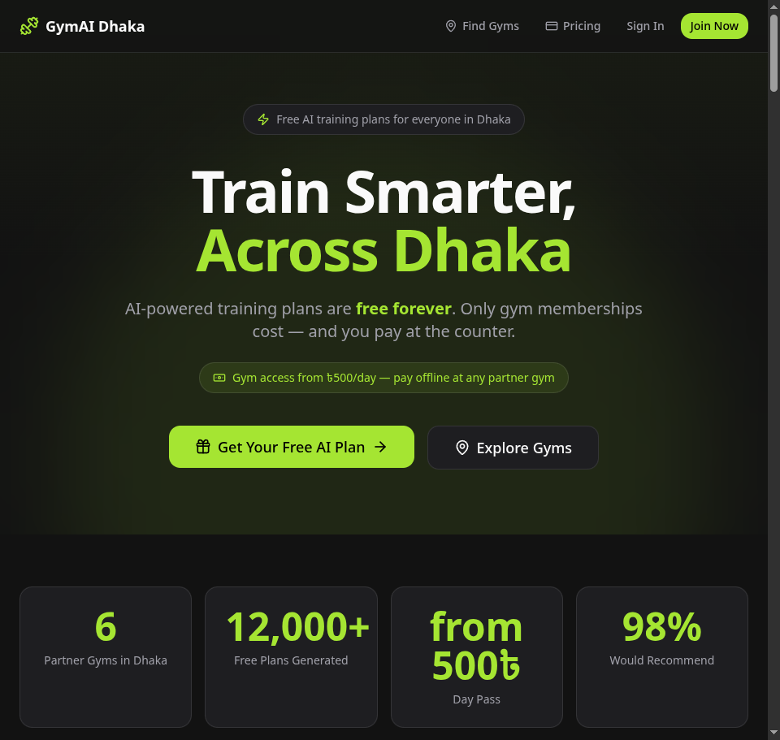
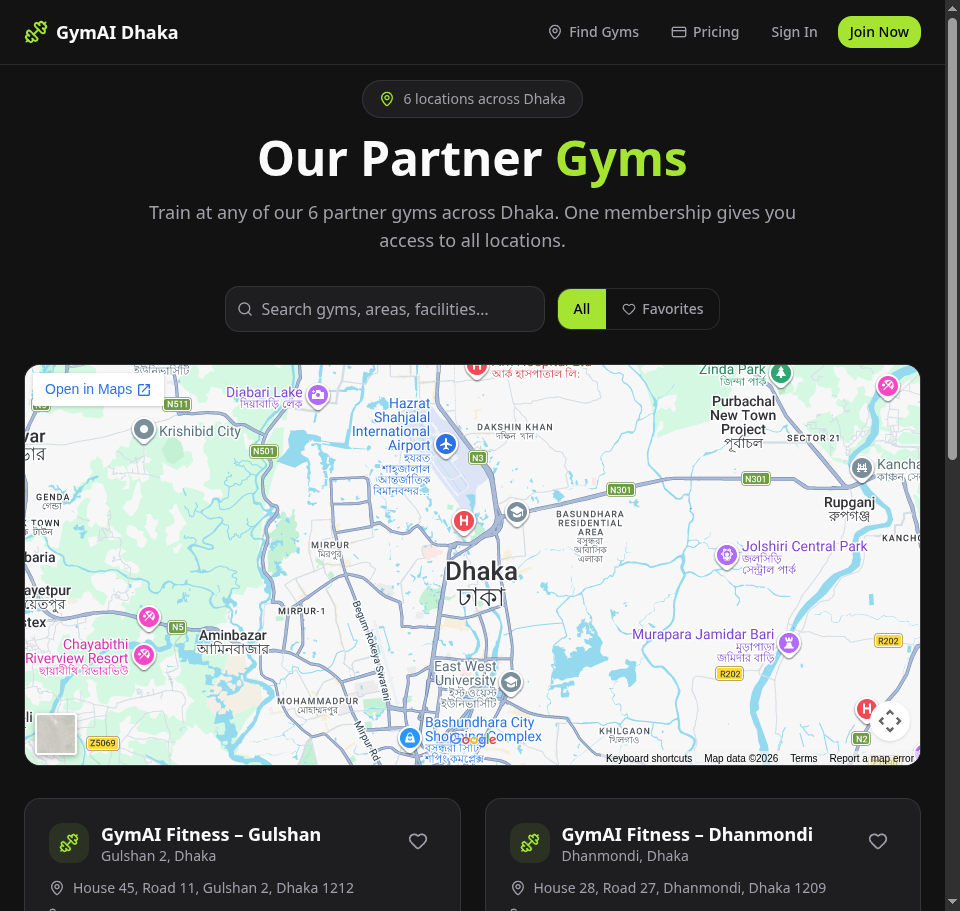
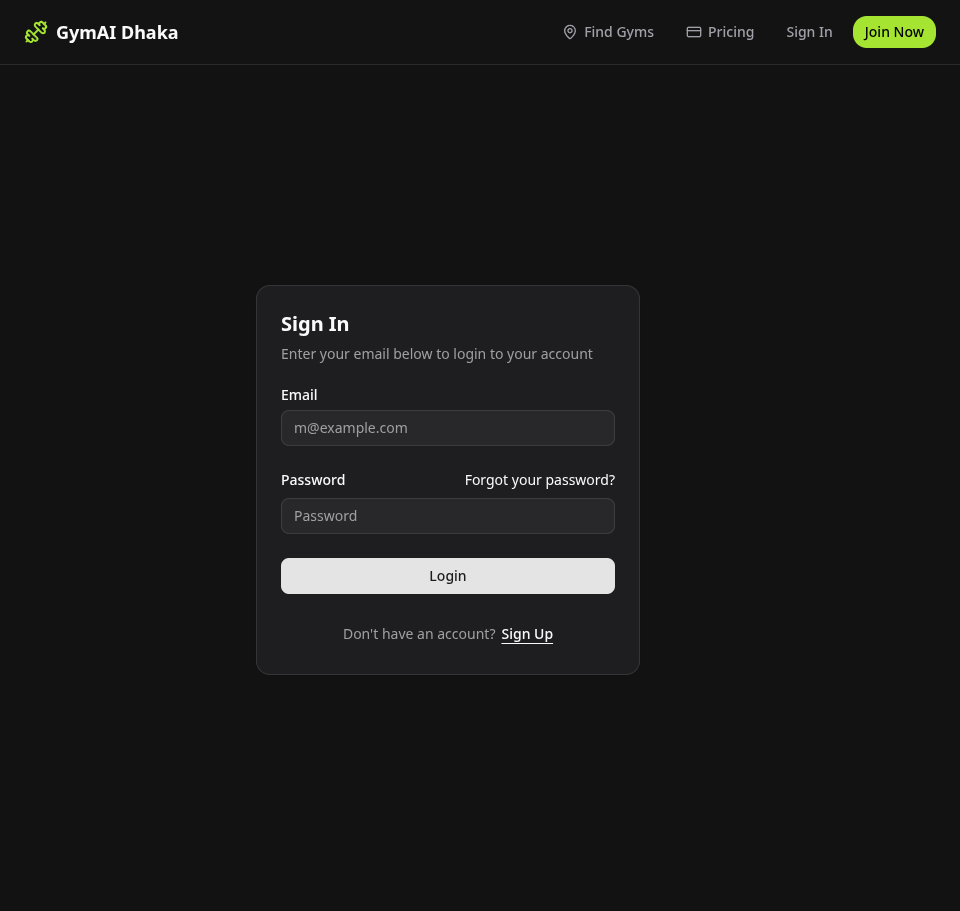
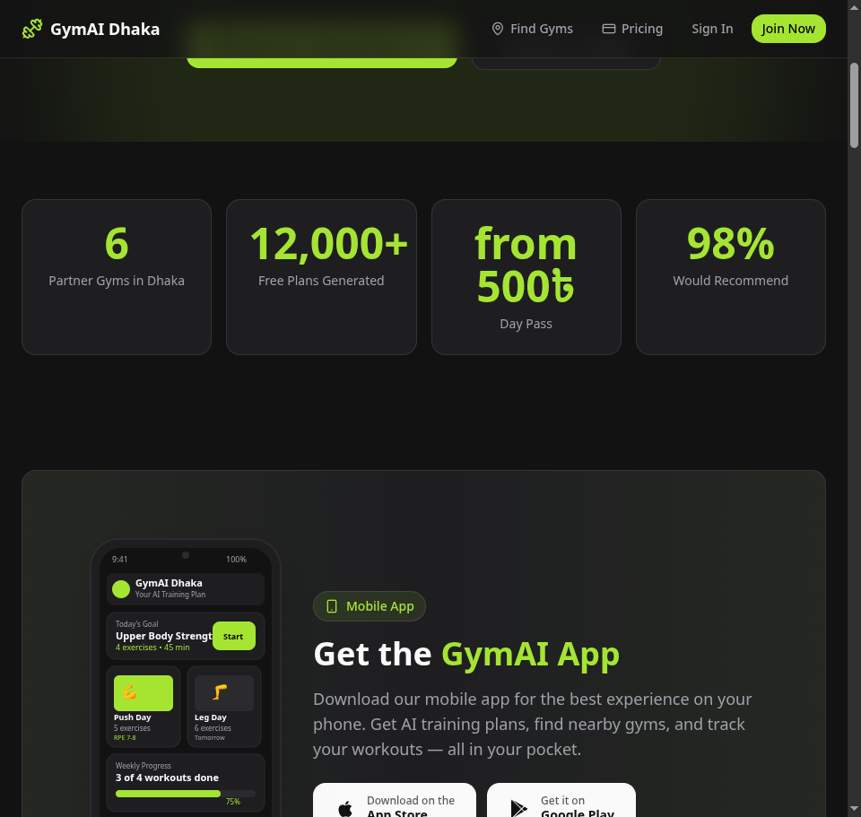

# GymAI Dhaka — AI-Powered Gym Partnership Network

A gym partnership platform in Bangladesh with **free AI-generated personal training plans**. Built with **Vite**, **React 19**, **Express**, **Prisma**, and the **OpenRouter AI** API.

Live demo: **https://gym-ai-dhaka.vercel.app/**

---

## Features

### Core
- **Free AI Training Plans** — Personalized programs built by AI for your goals, experience, and schedule. Always free, no card, no lock-in.
- **6 Partner Gyms** — Gulshan, Dhanmondi, Uttara, Mirpur, Banani & Mohakhali. One membership = all locations.
- **BDT Pricing** — Day passes from ৳500, monthly from ৳3,500 — paid offline at the gym counter (cash / bKash / Nagad).
- **Neon Auth** — Secure authentication via Neon.
- **AI Retry Logic** — Exponential backoff for OpenRouter API calls with smart error detection.
- **Form Validation** — Client- and server-side validation on onboarding.
- **Error Boundaries** — React error boundaries with graceful fallbacks.
- **Loading States** — Skeleton loaders for plan display and auth pages.
- **SEO** — Open Graph, Twitter cards, meta tags, canonical URL.

### Added in the latest redesign
- **BMI & TDEE Calculator** — Instant, free estimates of BMI and maintenance calories to baseline your plan.
- **Animated Stats Band** — Live count-up figures on scroll.
- **Testimonials** — Real-member stories from across Dhaka.
- **FAQ** — Expandable, answers the most common questions.
- **Scroll-Reveal Animations** — Polished entrance animations (Framer Motion) with `prefers-reduced-motion` support.
- **PWA Install** — Installable as a standalone app on mobile (web manifest + install prompt).
- **Progress Tracking** — Weekly workout completion ring + calendar; plan version history & viewer; copy/print/export.
- **Gym Favorites** — Save gyms locally and filter to favorites.
- **Toasts** — Accessible, dismissible notifications.

---

## Screenshots

| Home | Gyms | Auth |
|---|---|---|
|  |  |  |

| Fitness Calculator & Stats | Home (lower) |
|---|---|
|  |  |

---

## Tech Stack

| Layer | Technology |
|---|---|
| Frontend | React 19, TypeScript, Tailwind CSS 4, Vite 8, Framer Motion |
| Backend | Express 5, Prisma 7, Neon PostgreSQL |
| AI | OpenRouter (`openai/gpt-oss-20b:free`) with retry logic |
| Auth | Neon Auth |
| Icons | Lucide React |
| Routing | React Router v7 |
| Testing | Vitest + Testing Library |

---

## Project Structure

```
ai-gym-planner/
├── src/
│   ├── pages/              # Home, Auth, Account, Onboarding, Profile, Gyms, NotFound
│   ├── components/
│   │   ├── layout/        # Navbar, MobileBottomNav
│   │   ├── plan/          # PlanDisplay with skeleton loading
│   │   ├── sections/      # FitnessCalculator, Testimonials, Faq, StatsBand
│   │   └── ui/            # Button, Card, Select, Textarea, Toast, Reveal
│   ├── context/           # AuthContext + useAuth
│   ├── lib/               # api, auth, planExport, workoutLog, gymFavorites,
│   │                     #  fitness (BMI/TDEE), cn, useCountUp, usePwaInstall
│   ├── types/             # TypeScript types
│   └── data/              # gymData, testimonials
├── server/
│   ├── src/
│   │   ├── routes/        # API routes (profile, plan)
│   │   ├── lib/           # Prisma client, AI generator with retry
│   │   └── index.ts       # Express server with error handlers
│   └── prisma/            # Schema and migrations
├── tests/                  # Vitest tests
└── index.html              # SEO + PWA manifest
```

---

## Getting Started

### Prerequisites
- Node.js 18+
- A Neon PostgreSQL database
- An OpenRouter API key

### Setup

```bash
git clone git@github.com:MohammadMuntasirKabir/gymai-dhaka.git
cd gymai-dhaka
npm install

# Frontend env
cp .env.example .env
# Fill in VITE_NEON_AUTH_URL (your Neon Auth endpoint)

# Backend env (server/.env)
# DATABASE_URL=...      Neon PostgreSQL connection string
# OPEN_ROUTER_KEY=...   OpenRouter API key
# BASE_URL=...          Backend public URL
# CLIENT_URL=...        Frontend public URL
# PORT=3001

# Run the frontend (port 5173, proxies /api -> :3001)
npm run dev

# In another shell, run the backend
cd server
npm install
npm run dev:server
```

### Scripts

| Command | Description |
|---|---|
| `npm run dev` | Start the Vite dev server |
| `npm run build` | Type-check and build the production bundle (`dist/`) |
| `npm run lint` | Run ESLint |
| `npm run test` | Run the Vitest suite |
| `cd server && npm run dev:server` | Run the Express API with watch mode |

---

## Deployment

The entire app (frontend **and** backend API) is deployed as a single Vercel project. The Express API runs as a Vercel serverless function at `api/[[...path]].ts` (same origin, no separate backend host), so `VITE_API_URL` is left empty and the frontend calls `/api/...` directly.

### Required Vercel environment variables

| Variable | Scope | Value |
|---|---|---|
| `VITE_NEON_AUTH_URL` | build | Your Neon Auth endpoint (e.g. `https://<id>.neonauth...aws.neon.tech/neondb/auth`) |
| `VITE_API_URL` | build | _(empty)_ — API is served from the same Vercel domain |
| `DATABASE_URL` | runtime (serverless) | Neon PostgreSQL connection string |
| `OPEN_ROUTER_KEY` | runtime (serverless) | OpenRouter API key (plan generation uses `google/gemma-4-31b-it:free`) |
| `NODE_ENV` | runtime | `production` |

`prisma generate` runs automatically during `npm run build`. After deploying, run `npx prisma migrate deploy --schema server/prisma/schema.prisma` (or `prisma db push`) against `DATABASE_URL` to create the `user_profiles` / `training_plans` tables.

See `DEPLOY.md` for the original repository + environment setup notes.

---

## License

MIT
